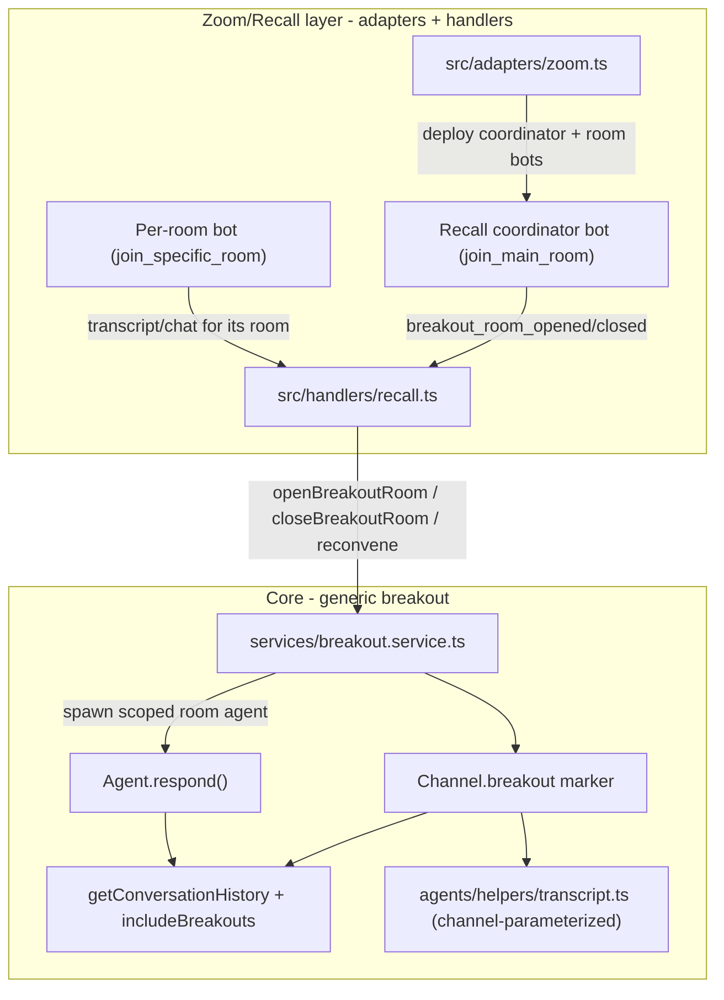

# Breakout Rooms: Architecture & Implementation

Status: Implemented — branch `jh/breakouts` (one item remaining, see [§5](#5-implementation-status))

This document describes how breakout-room support is added to the LLM Engine. It
covers the requirements, the architecture decisions (and the alternatives that
were discarded and why), and the implementation status of each piece.

---

## 1. Requirements

1. Each breakout room has the context of the parent (main) session, but **not**
   the context of the other simultaneous breakout rooms.
2. When breakouts close and the group reconvenes, the follow-up combined session
   has the **full** context of the initial main session **and** all breakout
   sessions, with each breakout's content **distinguishable**.
3. Generic breakout handling lives in **core** (so future adapters can have
   breakouts); Zoom/Recall-specific orchestration lives in **adapters/handlers**.
4. Breakouts can have a **name** and (optionally) a **description**.
5. Support **N breakout rooms simultaneously**, and **multiple breakout rounds
   sequentially** over the life of a session.

---

## 2. Relevant existing architecture

A short map of the pieces this feature builds on (verified in the codebase):

- **Conversation** owns `channels`, `agents`, `adapters`, and `features`
  (`src/models/conversation.model.ts`, `IConversation` in
  `src/types/index.types.ts`). The `features` array stores `{ name, enabled?,
config? }` entries and is already `Mixed`-typed.
- **Channel** is a lightweight doc: `name`, `passcode`, `direct`, `participants`
  (`src/models/channel.model.ts`). Messages are tagged with channel **name
  strings** (`src/models/message.model.ts`).
- **Context assembly** is an allow-list filter over channels:
  `getConversationHistory(messages, settings)` filters by
  `settings.channels` / `directMessages` / `count` / `timeWindow`
  (`src/agents/helpers/getConversationHistory.ts`). Settings come from the
  agent's `conversationHistorySettings` or per-trigger overrides, resolved in
  `Agent.respond()` (`src/models/user.model/agent.model/index.ts`).
- **Adapters** translate a platform to internal messages; **handlers** are the
  webhook HTTP ingress. The Zoom adapter (`src/adapters/zoom.ts`) deploys a
  **Recall.ai** bot; Recall webhooks land in `src/handlers/recall.ts`.
- **Crucially:** multiple Zoom bots per conversation are _already_ supported.
  `src/handlers/recall.ts` resolves the adapter by matching `botId` among
  `conversation.adapters` (line ~153), and `zoom.ts` already iterates multiple
  zoom adapters on one conversation (`participantJoined`, line ~400).
- **Recall breakout model**: one bot per room. A coordinator bot
  (`breakout_room.mode: join_main_room`) stays in the main room and receives
  `bot.breakout_room_opened` / `bot.breakout_room_closed`. A per-room bot
  (`mode: join_specific_room`, `room_id`) records a single room. Webhooks carry
  a normalized `room.id` and `room.name`. Requires Zoom's "Let participants
  choose room" setting.

---

## 3. Architecture decisions

### Decision A — Topology: one conversation, breakout room = scoped channels

A breakout round creates, **within the same conversation**, a set of channels
per room (a transcript channel and a chat channel), each tagged with a breakout
marker. Context isolation and reconvene are then expressed purely through the
existing channel allow-list filter.

- A room agent's context allow-list = `[parent channels] + [its own room
channels]`. Sibling rooms are excluded simply by not being on the list
  (Requirement 1).
- On reconvene, the main agent's allow-list expands to include all breakout
  channels, so it sees everything, labeled per room (Requirement 2).
- Sequential rounds = new `roundId` per open; prior rounds' channels persist
  (inactive) and remain available to the reconvened context (Requirement 5).
- N simultaneous rooms = N per-room bots = N extra zoom adapter docs on the same
  conversation, which the webhook layer already routes by `botId`.

**Why this topology:** the reconvene requirement is the deciding factor. In one
conversation, all messages already coexist and are filtered by channel, so
"combined, distinguishable context" is essentially free and reuses
`getConversationHistory`. It also matches the code as-is (multi-bot routing by
`botId`, channels as routing labels).

#### Discarded: each breakout room as a separate child conversation

Rejected. Each Recall bot maps cleanly to its own conversation, and sibling
isolation would be automatic — but it makes the two hardest requirements harder,
not easier:

- **Seeding parent context into a child** would require copying or
  cross-reading the parent's messages into each child conversation. No
  cross-conversation context mechanism exists today.
- **Reconvene** would require aggregating messages from N child conversations
  back into the parent's LLM context, distinguishably — again a brand-new
  cross-conversation capability, plus cross-conversation transcript/RAG search.
- It duplicates transcript handling (`ITranscript` and the RAG collection are
  per-conversation) across many short-lived conversations.

In short, child conversations optimize for isolation (which channels already
give us) at the cost of the aggregation we actually need.

#### Discarded: a dedicated `Breakout`/`BreakoutRoom` Mongoose collection

Rejected as the primary store. A separate collection would duplicate the
room→channel→round→agent relationships that channels + a marker already express.
Instead, breakout channels (channels carrying a `breakout` marker) are the
**source of truth**; rounds are derived by grouping on `roundId`. This keeps the
data model small and reuses channel auth/routing/queries. (If a richer breakout
entity is ever needed, it can be introduced later without changing the channel
contract.)

### Decision B — Context scoping primitive: `includeBreakouts` flag

Room agents get an explicit channel allow-list at spawn time, so **no new
primitive is needed for isolation**. The only dynamic case is the main agent
needing to pull in breakout channels that did not exist when it was configured.
We add `includeBreakouts?: boolean` to `ConversationHistorySettings`
(default `none`) and resolve it in `Agent.respond()` (where the populated
conversation/channels are available) by expanding `settings.channels` before
calling `getConversationHistory`.

- `false` / absent (default): breakout content is excluded from the main agent during a
  live round.
- `true`: breakout channels are merged in for the reconvened combined session.

**Why here:** it keeps `getConversationHistory` a pure function (it already only
knows about a flat message list + settings) and localizes breakout awareness to
`respond()`, which already does channel resolution.

#### Discarded: a generic `excludeChannels` blocklist

Rejected. A blocklist would require every agent to know the (dynamic) set of
breakout channels to avoid, inverting the existing allow-list model and leaking
breakout knowledge into unrelated agents. The allow-list + `includeBreakouts`
expansion keeps breakout logic in one place.

### Decision C — Where breakout configuration lives: `enableBreakouts` + internal properties

Breakout configuration is split across two locations:

**`conversation.enableBreakouts: boolean`** — top-level schema field alongside
`enableAgents` and `enableDMs`. Gates the capability: "does this conversation
support breakout rooms?" The breakout service is platform-agnostic, so this flag
is a conversation-level concern, not a Zoom-specific one. Any future adapter that
surfaces a "room opened" event can check the same field.

**`conversation.properties.breakoutAgentTypes` / `breakoutNamePrefix`** —
eventAssistant-specific wiring, stored as internal `ConfigProperty` entries
(`type: 'array'` / `type: 'string'`, `internal: true`). These control which
agent types to spawn per room and how to name the bots. They are conversation-type
policy, not engine-level capability, so `properties` is the right home. They are
not exposed in the event creation UI.

The Zoom adapter checks `conversation.enableBreakouts` to decide coordinator mode.
The breakout service reads `breakoutAgentTypes` from properties for agent
spawning (defaulting to `[]` when absent — valid: breakout transcription without
agents is a supported use case).

**`agentTypes` must be listed explicitly.** There is no default or inference —
if an agent type is not listed, it does not run in breakout rooms. Agents not
listed (e.g. eventMediator, engagementAgent) still receive full breakout history
after reconvene via the `includeBreakouts` mechanism.

Note: there is no "coordinator agent." The Recall coordinator bot (the Zoom bot
that stays in the main room to receive webhook events) is a platform/adapter
concept. The main session agent is unchanged — it is simply scoped to main
channels during breakouts and given an expanded allow-list on reconvene.

#### Discarded: gating coordinator deployment on `breakoutAgentTypes` being non-empty

Rejected. A conversation may want breakout room transcription and channel
segmentation without any per-room agents. The capability flag (`enableBreakouts`)
and the agent policy (`breakoutAgentTypes`) are independent concerns.

#### Discarded: breakout config as a conversation feature

Rejected. `conversation.features` is for organizer-controlled, UI-visible
behavior. Breakout wiring is infrastructure that most organizers will never
configure. A hidden property avoids cluttering the feature list and the event
creation form.

#### Discarded: breakout config on `agentConfig`

Rejected. `agentConfig` is agent response policy (prompts, tools, history
behavior). Whether to deploy a bot in coordinator mode and which agent type to
spawn per room are conversation-level and infrastructure concerns, not agent
policy. Putting them on `agentConfig` creates a dependency where the Zoom
adapter must reach into agent internals to configure itself.

#### Discarded: breakout config on the Adapter

Rejected for the policy parts. The adapter should not encode which agent type to
spawn or its history behavior — that is conversation intent, not platform
plumbing.

### Decision D — Room definition: dynamic discovery + optional enrichment

Rooms are discovered at runtime from Recall webhooks (`room.id`, `room.name`),
because Zoom breakouts (whether pre-assigned or impromptu) only surface to us
when they open. The optional `config.rooms[]` in the breakout feature provides
name/description **enrichment** matched against the Zoom room name. Description
is purely our own concept (Zoom has none), so it is a nice-to-have.

#### Discarded: fully pre-configured rooms matched to Zoom

Rejected as the primary path. Zoom room identity/ordering is not reliably known
ahead of time; forcing pre-declaration would break impromptu breakouts. Dynamic
discovery with optional enrichment covers both planned and impromptu cases.

### Decision E — Zoom orchestration via coordinator + per-room bots

When `conversation.enableBreakouts` is true, the main adapter deploys its Recall
bot in `join_main_room` mode. On `bot.breakout_room_opened`, the handler creates a
per-room zoom adapter and dispatches a `join_specific_room` bot, then calls the
core breakout service. Each room bot's transcript/chat is routed to that room's
channels via the room adapter's own `audioChannels`/`chatChannels`, so existing
inbound/outbound routing is reused unchanged.

#### Discarded: a single bot hopping between rooms

Rejected — impossible by Recall's model (a bot records one room at a time) and
unable to capture N rooms concurrently.

---

## 4. Data flow



Lifecycle:

1. Session starts; if `conversation.enableBreakouts` is true, the Zoom adapter
   deploys the Recall bot in `join_main_room` mode.
2. Host opens breakouts → `bot.breakout_room_opened` per room → handler creates
   per-room adapter + bot and calls `breakoutService.openBreakoutRoom`, which
   creates the room's channels and spawns a scoped room agent per type in
   `conversation.properties.breakoutAgentTypes` (may be empty — transcription
   without agents is valid).
3. During the round: each room agent sees parent + own channels only; the main
   agent excludes breakout channels.
4. Host closes breakouts → `bot.breakout_room_closed` per room →
   `closeBreakoutRoom`; when the round is empty, `closeBreakoutRound` +
   `reconvene` flips the main agent to `includeBreakouts: true`.
5. Subsequent rounds repeat with a fresh `roundId`; all prior content remains in
   the reconvened context, labeled per room.

---

## 5. Implementation status

### ✅ Done — Channel breakout marker (core)

`src/models/channel.model.ts`, `src/types/index.types.ts`.

`IChannel` has an optional `breakout` field:

```ts
breakout?: {
  roomId: string
  roundId: string
  type: 'chat' | 'transcript'
  parentChannel: string
  name?: string
  description?: string
  active?: boolean
}
```

### ✅ Done — Breakout service (core)

`src/services/breakout.service.ts`.

- `openBreakoutRoom`: creates per-room chat + transcript channels (named
  `breakout/{roundId}/{roomId}/chat` and `.../transcript`), spawns room agents
  per `conversation.properties.breakoutAgentTypes`, starts them.
- `closeBreakoutRoom`: marks the room's channels `active: false`, deactivates
  room agents.
- `closeBreakoutRound` / `reconvene`: closes all rooms in a round and sets
  `includeBreakouts: true` on all active non-room agents.

### ✅ Done — Context scoping (core)

`src/types/index.types.ts`, `src/models/user.model/agent.model/index.ts`.

`includeBreakouts?: boolean` added to `ConversationHistorySettings`. In
`Agent.respond()`, when this flag is set, the resolved channel allow-list is
expanded with all breakout channel names present on the conversation.

### ✅ Done — Agent chat/transcript channel resolution (core)

`src/agents/helpers/agentChannels.ts`.

`getChatHistoryChannelNames(agent)` and `getTranscriptHistoryChannelNames(agent)`
return the correct channel names depending on context:

| Agent context                                    | Chat channels                       | Transcript channels                             |
| ------------------------------------------------ | ----------------------------------- | ----------------------------------------------- |
| Breakout room agent                              | Room's breakout chat channel        | Room's breakout transcript channel              |
| Reconvened main agent (`includeBreakouts: true`) | `chat` + all breakout chat channels | `transcript` + all breakout transcript channels |
| Normal agent                                     | `['chat']`                          | `['transcript']`                                |

`isOnChatChannel(agent, channelNames)` is used in `evaluate()` to correctly gate
bot-mention checks for room agents.

### ✅ Done — Transcript parameterization (core, message-based)

`src/agents/helpers/transcript.ts`.

`searchTranscript`, `getTranscriptMessages`, and `getTranscript` all take `agent`
rather than a raw conversation and call `getTranscriptHistoryChannelNames(agent)`
for channel filtering. Room agents only see their own room's transcript messages;
reconvened agents see all of them.

### ✅ Done — Response channel remapping (core)

`src/models/user.model/agent.model/index.ts`.

After `agentType.respond()` returns, if the agent has `agentConfig.breakout`,
any logical parent channel references in `response.channels` (e.g. `{ name: 'chat' }`)
are remapped to the matching breakout channel for that room before the message
is persisted. This means agent implementations return logical channel names and
are unaware of the physical breakout channel naming.

### ✅ Done — History formatting for reconvened context (core)

`src/agents/helpers/llmInputFormatters.ts`.

When formatting conversation history for a reconvened agent, messages from
breakout channels are labeled with their room name (e.g. `[Room A]`) so the LLM
can attribute content per room.

### ✅ Done — Schema and property wiring

`src/types/index.types.ts`, `src/models/conversation.model.ts`,
`src/conversations/eventAssistant.ts`.

- `enableBreakouts?: boolean` on `IConversation` and the Mongoose schema.
- `breakoutAgentTypes` (internal array) and `breakoutNamePrefix` (internal
  string) as `ConfigProperty` entries on the eventAssistant conversation type.

### ✅ Done — Recall handler (Zoom-specific)

`src/handlers/recall.ts`.

Handles `bot.breakout_room_opened` and `bot.breakout_room_closed`. On open:
creates per-room zoom adapter, dispatches `join_specific_room` bot, calls
`breakoutService.openBreakoutRoom`. On close: stops the room bot, calls
`closeBreakoutRoom`; when the round empties, calls `reconvene`. Routes inbound
transcript/chat messages to the room adapter via `botId` resolution (unchanged
from the multi-bot pattern).

### ✅ Done — Zoom adapter (Zoom-specific)

`src/adapters/zoom.ts`.

When `conversation.enableBreakouts` is true, deploys the Recall bot in
`join_main_room` mode. Room bots (those with `config.breakoutRoom` set) are
deployed in `join_specific_room` mode. `getUniqueKeys()` includes `config.botId`
for breakout adapters to prevent key collisions between adapters sharing the same
`meetingUrl`.

---

### 🔲 TODO — Transcript RAG scoping by breakout room

`src/agents/helpers/transcript.ts`, `loadTranscriptIntoVectorStore`.

The message-based transcript path (channel filtering) is fully breakout-aware.
The **vector-store / RAG path** is not yet. Currently:

- All transcript chunks — including breakout room transcripts — are stored in
  the single per-conversation collection `event-transcript-{conversationId}`.
- `searchTranscript` queries that collection without any room filter, so a
  breakout room agent's semantic search can surface chunks from sibling rooms.

What needs to be done:

- Add breakout metadata (`roomId`, `roundId`, `channel`) to each chunk in
  `loadTranscriptIntoVectorStore` when the message originated on a breakout
  channel.
- In `searchTranscript`, apply a metadata filter scoping the query to the
  agent's room when the agent is a breakout room agent (use
  `getTranscriptHistoryChannelNames` to derive the filter, consistent with the
  message-based path).
- Audit `clearTranscript` / `deleteTranscript` to ensure breakout-channel
  transcript messages are included in cleanup operations.

### 🔲 TODO — WebSocket events on breakout room opened/closed for FE

Initial P0 idea was to have NextSpace construct separate URLs for each breakout room with appropriate
channel passcodes and put the URLs in the moderator view for distribution to each room that was using the
NextSpace front end. This would keep rooms siloed because they would not know the channel passcodes to construct the URLs to other rooms.

Sending websocket events on breakout room opened and closed could be implemented to support this. The front end work would also need to be done to construct and display the URLs.

### 🔲 TODO — Add ModeratorNotifier to breakout agent types?

Right now there are no periodic agents configured to run in the eventAssistant conversation type breakout rooms, but there is theoretically no reason that wouldn't work. We determined it doesn't make sense to do proactive group chat interventions in breakouts like using eventMediator or engagementAgent. But if moderator support feature is enabled, should moderatorNotifier run in every breakout room?

### 🔲 TODO — Breakout Room Reporting

Message reports should include breakout group chat messages

Should front end Matomo reports also be modified somehow to include stats on breakout URL usage?

### 🔲 TODO — Post Event Summaries include breakout chat/transcript context?

Should summaries generated by `lifecycle.ts` on conversation stop include chat and transcript from breakout rooms?

## 5. Testing & known issues

The first section of agent-level commits is pretty well unit/integration tested. The breakout service and Zoom layer definitely need more automated tests.

I did a quick manual run through of creating breakouts in Zoom:

1. I opened a breakout room in Zoom (NOTE: you MUST use the 'Let Participants Choose Room' option in order for Recall's coordinator bot approach to work).
2. A bot was deployed into the breakout room
3. I joined the breakout room. I verified that transcription from that breakout room was not recording on the main transcript channel (log messages indicated they were put on breakout channel and they were not visible in main transcript)
4. Closed the breakout room

Ran into these issues:

1. Breakout room bots are deployed with the name 'Breakout-Room-[x]' rather than anything with 'Berkie' in it. This also makes the @ mention feature in group chat problematic (agent uses regex to recognize Berkie). Granted, we don't rely as heavily on the @ mention now that Berkie can just respond to anything, but should still be able to do it.
2. The bot did not respond to DMs in the breakout room
3. **Important** When I closed the breakout room, both the breakout bot and main bot left the meeting. Recall indicated a timeout_exceeded_everyone_left event. This may be a Recall bug.

Testing with multiple participants in breakout rooms and main conversation and reconvene still needed. Also need to double check that agents have the correct context in both the main and breakout rooms.

Need to verify multiple rounds of breakouts as well.
