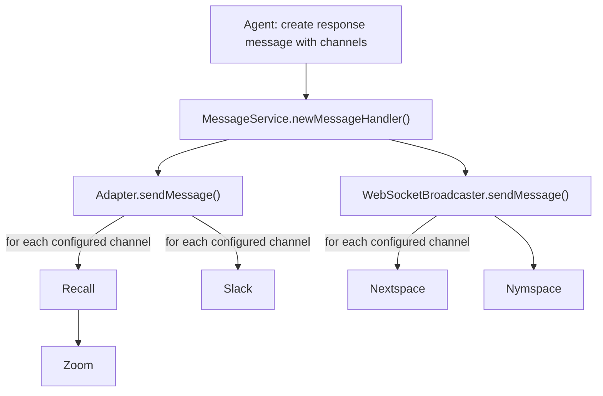

```mermaid
flowchart TD
    Agent --> MessageService
    MessageService --> Adapter
    MessageService --> WebSocketBroadcaster
    Adapter --> |"for each configured channel"| Recall
    Adapter --> |"for each configured channel"| Slack
    Recall --> Zoom
    WebSocketBroadcaster --> |"for each configured channel"| Nextspace
    WebSocketBroadcaster --> Nymspace

    Agent["Agent: create response message with channels"]
    MessageService["MessageService.newMessageHandler()"]
    Adapter["Adapter.sendMessage()"]
    WebSocketBroadcaster["WebSocketBroadcaster.sendMessage()"]
    Recall["Recall"]
    Zoom["Zoom"]
    Slack["Slack"]
    Nextspace["Nextspace"]
    Nymspace["Nymspace"]
```
