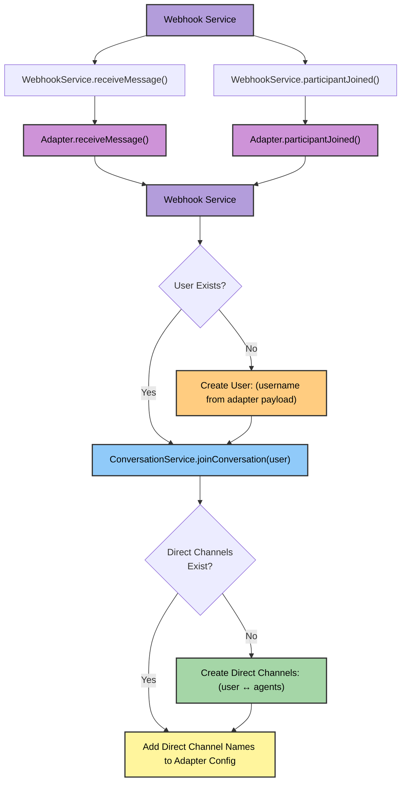

```mermaid
graph TD
    WS[Webhook Service] --> RM["WebhookService.receiveMessage()"]
    WS --> PJ["WebhookService.participantJoined()"]

    RM --> ARM["Adapter.receiveMessage()"]
    PJ --> APJ["Adapter.participantJoined()"]

    ARM --> WS2[Webhook Service]
    APJ --> WS2

    WS2 --> CHK{User Exists?}

    CHK -->|No| CU["Create User: (username from adapter payload)"]
    CHK -->|Yes| JC

    CU --> JC["ConversationService.joinConversation(user)"]

    JC --> CDC{Direct Channels<br/>Exist?}

    CDC -->|No| CREATE["Create Direct Channels: (user ↔ agents)"]
    CDC -->|Yes| ADD

    CREATE --> ADD["Add Direct Channel Names to Adapter Config"]

    style WS fill:#b39ddb,stroke:#333,stroke-width:2px,color:#000
    style WS2 fill:#b39ddb,stroke:#333,stroke-width:2px,color:#000
    style ARM fill:#ce93d8,stroke:#333,stroke-width:2px,color:#000
    style APJ fill:#ce93d8,stroke:#333,stroke-width:2px,color:#000
    style CU fill:#ffcc80,stroke:#333,stroke-width:2px,color:#000
    style JC fill:#90caf9,stroke:#333,stroke-width:2px,color:#000
    style CREATE fill:#a5d6a7,stroke:#333,stroke-width:2px,color:#000
    style ADD fill:#fff59d,stroke:#333,stroke-width:2px,color:#000
```
