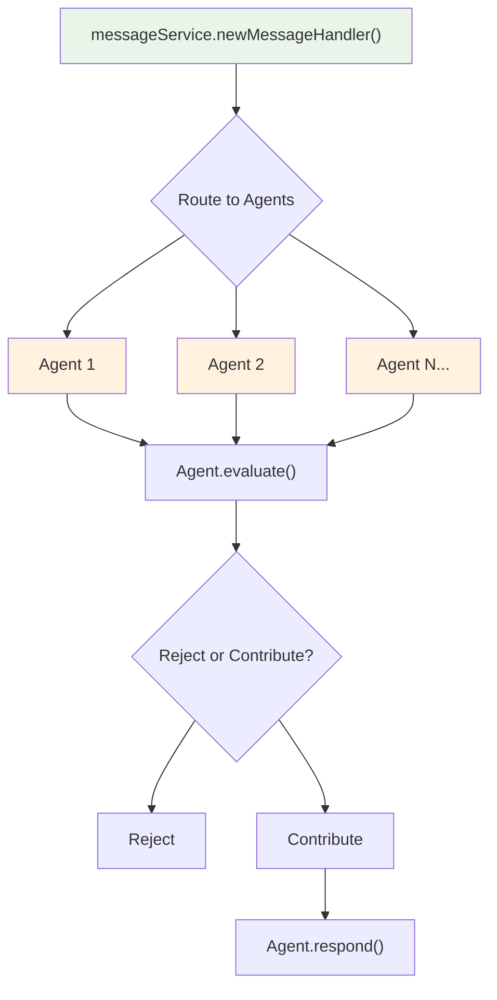

```mermaid
graph TD
    MS["messageService.newMessageHandler()"] --> L{Route to Agents}
    L --> AG1[Agent 1]
    L --> AG2[Agent 2]
    L --> AG3[Agent N...]

    AG1 --> E["Agent.evaluate()"]
    AG2 --> E
    AG3 --> E

    E --> R{Reject or Contribute?}
    R --> REJ[Reject]
    R --> CONT[Contribute]

    CONT --> RESP["Agent.respond()"]

    style MS fill:#e8f5e8
    style AG1 fill:#fff3e0
    style AG2 fill:#fff3e0
    style AG3 fill:#fff3e0
```
