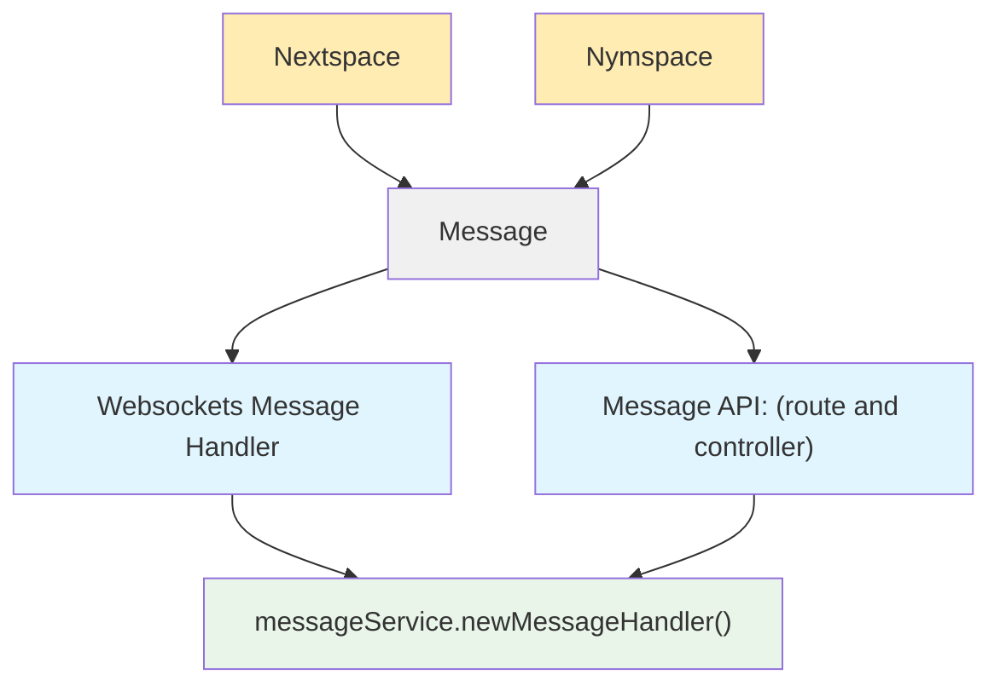

```mermaid
graph TD
    N[Nextspace] --> M[Message]
    NY[Nymspace] --> M
    M --> C[Websockets Message Handler]
    M --> D["Message API: (route and controller)"]

    C --> K["messageService.newMessageHandler()"]
    D --> K

    style N fill:#ffecb3
    style NY fill:#ffecb3
    style M fill:#f0f0f0
    style C fill:#e1f5fe
    style D fill:#e1f5fe
    style K fill:#e8f5e8
```
