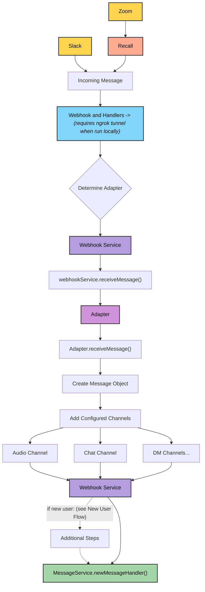

```mermaid
graph TD
    Z[Zoom] --> R[Recall]
    S[Slack] --> A[Incoming Message]
    R --> A[Incoming Message]
    A --> B["Webhook and Handlers -> <i>(requires ngrok tunnel when run locally)</i>"]
    B --> C{Determine Adapter}
    C --> WS[Webhook Service]

    WS --> WR["webhookService.receiveMessage()"]
    WR --> D[Adapter]

    D --> E["Adapter.receiveMessage()"]
    E --> F[Create Message Object]
    F --> G[Add Configured Channels]

    G --> H[Audio Channel]
    G --> I[Chat Channel]
    G --> J[DM Channels...]

    H --> WS2[Webhook Service]
    I --> WS2
    J --> WS2

    WS2 -.->|"if new user: (see New User Flow)"| NU[Additional Steps]
    NU -.-> K["MessageService.newMessageHandler()"]
    WS2 --> K

    style S fill:#ffd54f,stroke:#333,stroke-width:2px,color:#000
    style Z fill:#ffd54f,stroke:#333,stroke-width:2px,color:#000
    style R fill:#ffab91,stroke:#333,stroke-width:2px,color:#000
    style B fill:#81d4fa,stroke:#333,stroke-width:2px,color:#000
    style WS fill:#b39ddb,stroke:#333,stroke-width:2px,color:#000
    style WS2 fill:#b39ddb,stroke:#333,stroke-width:2px,color:#000
    style D fill:#ce93d8,stroke:#333,stroke-width:2px,color:#000
    style K fill:#a5d6a7,stroke:#333,stroke-width:2px,color:#000
```
