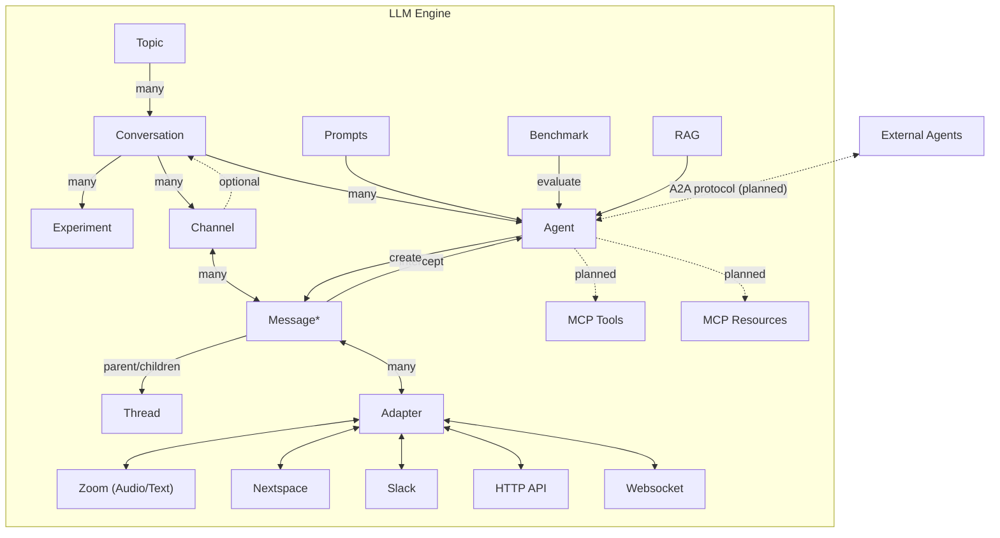

# LLM Engine Developer Documentation

## Developer Capabilities and Features

✅ Include **multiple LLM agents** in a **voice or text** conversation using our REST and Websocket APIs

✅ Configure agents to **intercept and respond to user messages immediately** and/or **execute periodically**

✅ Configure agents to **receive and respond to messages on a variety of channels**, including directly to a user.

✅ Choose from a **variety of agent templates** and easily create new ones

✅ **Support for multiple LLM models** including OpenAI and open-source models using [Ollama](https://ollama.com/search), [Runpod](http://runpod.io), and [Modal](http://modal.com). (More coming soon!)

✅ **Modify agent prompts, models, and RAG materials** via API to create custom interventions

✅ **Support for plain text and structured data messages/payloads**

✅ Use with **multiple simultaneous front-end clients** such as Nextspace and Zoom **in a single conversation**

✅ **Access and save real-time and full event transcripts**, from both text and audio interactions

✅ Supports organizing **events** into **topics**. Events can have **channels** to segment a conversation.

✅ **JWT authentication** and support for **pseudonymous user interaction**, **user persistence** and optional **login**.

✅ Support for **prompt experimentation, testing and reporting**, including replaying previous events with revised prompts

✅ **Define and configure your own agents via API** and **customize conversation flow**

✅ Observe and evaluate agent performance using Langsmith and Promptfoo

✅ Support **threaded messages**

[ ] LLM **automated prompt iteration and refinement**

## System Description

1. Conversations are organized into "Topics"
2. Conversations have many sequential Messages.
3. Messages can contain structured data and be threaded through a parent/child relationship between Messages.
4. Messages can be received or sent through different Adapters connected to various transports (e.g. Websockets or HTTP API) and platforms (e.g. Zoom, Slack or Nextspace).
5. Messages can be sent or received through one or more Channels to segregate different audiences (e.g. a moderator vs. participants) or content (e.g. group messages, DMs or audio transcripts)
6. Agents can
   a. Intercept each message or be scheduled to run periodically
   b. Evaluate Conversation history as desired and respond or reject user messages.
   c. Make use of RAG if desired
7. Conversations can be replayed with different Agent configurations as Experiments to learn and iterate Agent designs.
8. Benchmarks can be developed to evaluate Agents on different dimensions.

Note: Since messages allow for **structured data** they can act as a [transaction log](https://en.wikipedia.org/wiki/Transaction_log), supporting a wide variety of use contexts beyond messaging apps (e.g. also gaming, real-time collaboration tools). This transaction log also enables **agent replay** and **experiments**.

## System Diagram

Below is a diagram of the primary system components and how they are connected.

## Repo/Folder overview
* docs - Documentation files, including this file!
* k6 - Load testing
* promptfoo - [Promptfoo](https://www.promptfoo.dev/) safety testing configuration
* rag_documents - Saved documents used with some agents
* report_templates - Templates used for generating reports
* src - Main source code folder
  * adapters - Adapters for different communication platforms (e.g. Zoom, Slack)
  * agents - Conversational agent configuration and code
  * config - Main app config
  * controllers - API route controllers
  * conversations - Conversations config
  * docs - OpenAPI docs helpers
  * handlers - Various handlers
  * jobs - Scheduled job handlers
  * middlewares - expressjs middleware
  * models - mongoose/mongodb data models
  * routes - api route definitions
  * services - core services used by controllers and elsewhere
  * types - type definitions
  * utils - various utilities
  * validations - API validations
  * websockets - websocket handlers
* tests - Extensive automated tests

## API documentation

OpenAPI documentation is available when running the app locally at the route `v1/docs`.

In particular, see the examples in the `POST` `Conversations` endpoint for how to create conversations with certain agent types.

## Understanding Message Control Flow

It can be very helpful to understand the Message routing and control flow to and from Agents and different platforms through Adapters.

#### Diagrams

You can find several diagrams to help you understand the message routing and control flow.

**[Received Message Routing to Agents](diagrams/receive_message_agent_routing.md)**
Describes how new messages are processed and routed through different agents for action.

**[Agent Evaluate and Respond](diagrams/agent_respond_message.md)**
Describes how agents evaluate and choose to respond to or reject received messages.

**[Agents Receive a Message from Nextspace or Nymspace](diagrams/receive_message_from_nextspace_or_nymspace.md)**
A more detailed description of what happens when a message is received from a websocket-based web app like Nextspace or Nymspace.

**[Agents Receive a Message from Zoom or Slack](diagrams/receive_message_from_zoom_or_slack.md)**
A more detailed description of what happens when a message is received from an external app like Zoom or Slack.

**[New Users via an Adapter](diagrams/new_adapter_user_creation.md)**
Describes how new system users are created as needed on demand when they encountered through an Adapter

## Tests and Benchmarks

### Unit and integration tests

Unit and integration tests can be run with `yarn run test`, and a coverage report can be seen with `yarn run coverage`.

### Agent tests

Tests of the built-in "production" agent types can be run with `yarn test:agents`.

## Production vs. Development Agents

A few agent types have been carefully tested and vetted for "production" use. There are other experimental [development agent](development_agents.md) types under development in the `agents/development` folder. Be careful running development agents! They should only be used in experimental or development contexts.

### Enabling development agents

In your `.env` file set `ENABLE_DEVELOPMENT_AGENTS=true`.

### Testing development agents

To run tests of the built-in development agent types, run `yarn test:agents:development`.

## Production vs. Development Platforms

A few platforms types have been carefully tested and vetted for "production" use (e.g. Nextspace and Zoom). There are other experimental [development platforms](development_platforms.md) under development. New platforms can be added by create a new [adapter](adapters.md). Be careful with development platforms! They should only be used in experimental or development contexts.

### Enabling development platforms

In your `.env` file set `ENABLE_DEVELOPMENT_ADAPTERS=true`.

## OpenAPI specs and types

The server exposes our OpenAPI spec at `/v1/openapi.json`.
You can use the `package.json` script `openapi-types:generate` to generate a corresponding types file which is placed at `src/types/openapi.d.ts`.
Both the backend and the frontend can use this OpenAPI route and this script to generate type files, instead of having to important them as a separate package. Nice!
